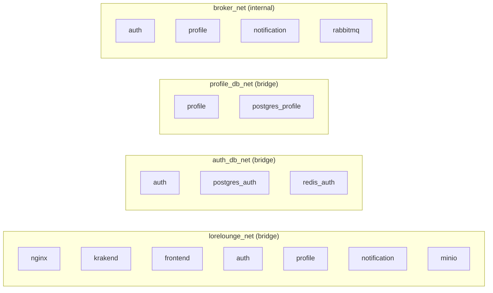
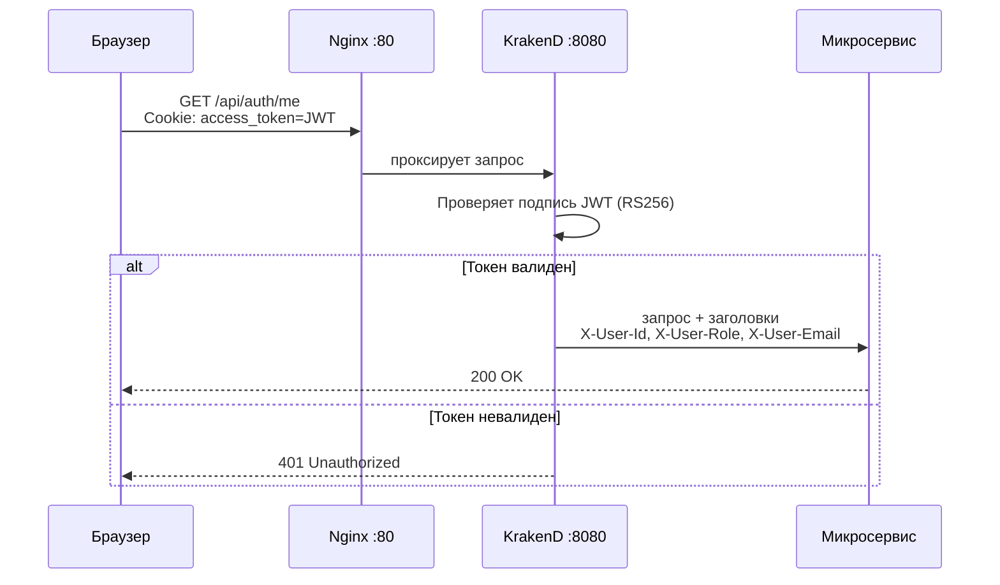

# LoreLounge

**LoreLounge** — платформа для чтения и каталогизации веб-новелл.

> Единственная публичная точка входа — **Nginx :80**. Все остальные порты открыты только для локальной отладки.

---

## Содержание

- [Стек технологий](#стек-технологий)
- [Архитектура](#архитектура)
- [Сетевая изоляция](#сетевая-изоляция)
- [Структура проекта](#структура-проекта)
- [Микросервисы](#микросервисы)
- [Быстрый старт](#быстрый-старт)
- [Маршрутизация](#маршрутизация)
- [Лицензия](#лицензия)

---

## Стек технологий

| Слой | Технологии |
|------|-----------|
| **Frontend** | Next.js 15, React 19, Tailwind CSS 4 |
| **Reverse Proxy** | Nginx |
| **API Gateway** | KrakenD 2.5 (Flexible Configuration) |
| **Микросервисы** | FastAPI (auth, profile), FastStream (notification) |
| **Базы данных** | PostgreSQL 15 (per-service), Redis 7 |
| **Хранилище файлов** | MinIO |
| **Брокер сообщений** | RabbitMQ 3 |
| **Инфраструктура** | Docker, Docker Compose, Make |

---

## Архитектура


---

## Сетевая изоляция

Каждый сервис видит только те соседей, которые ему нужны.



| Сеть | Участники | Примечание |
|------|-----------|-----------|
| `lorelounge_net` | nginx, krakend, frontend, auth, profile, notification, minio | Основная сервисная сеть |
| `auth_db_net` | auth, postgres_auth, redis_auth | Изолирована: только auth видит свою БД |
| `profile_db_net` | profile, postgres_profile | Изолирована: только profile видит свою БД |
| `broker_net` | auth, profile, notification, rabbitmq | `internal: true` — без выхода наружу |

### Открытые порты

| Сервис | Внешний порт | Назначение |
|--------|:------------:|-----------|
| nginx | **80** | Единственная публичная точка входа |
| auth | 8000 | Прямой доступ для отладки |
| profile | 8001 | Прямой доступ для отладки |
| postgres_auth | 5432 | DataGrip / миграции |
| postgres_profile | 5433 | DataGrip |
| rabbitmq mgmt | 15672 | RabbitMQ Web UI |
| minio api | 127.0.0.1:9000 | S3 API (loopback) |
| minio console | 127.0.0.1:9001 | MinIO Console (loopback) |

---

## Структура проекта

```text
LoreLounge/
├── docs/                        # Общая документация
├── gateway/                     # API Gateway (KrakenD) и Reverse Proxy (Nginx)
├── frontend/                    # Next.js приложение
├── infra/                       # Docker Compose, скрипты, конфиги БД
├── services/                    # Микросервисы
│   ├── auth/                    # [README](services/auth/README.md) — Auth & Roles (FastAPI)
│   ├── profile/                 # [README](services/profile/README.md) — User Profiles (FastAPI)
│   ├── notification/            # [README](services/notification/README.md) — Emails (FastStream)
│   ├── content/                 # [в разработке] Новеллы и главы
│   └── comment/                 # [в разработке] Комментарии
└── Makefile                     # Команды управления проектом
```

---

## Микросервисы

Подробную информацию о функционале, API и настройках каждого сервиса можно найти в их внутренних документах:

1.  [**Auth Service**](services/auth/README.md) — Регистрация, вход, JWT (RS256), роли, сброс пароля.
2.  [**Profile Service**](services/profile/README.md) — Профили, загрузка аватаров (MinIO), черные списки.
3.  [**Notification Service**](services/notification/README.md) — Отправка email через RabbitMQ.

---

## Быстрый старт

### Требования

- Docker 24+
- Docker Compose 2.20+
- Make

### Шаги

```bash
# 1. Скопировать переменные окружения
cp .env.example .env
cp services/auth/.env.example services/auth/.env
cp services/profile/.env.example services/profile/.env

# 2. Сгенерировать RSA-ключи для JWT
make certs

# 3. Применить миграции БД
make migrate

# 4. Запустить все сервисы
make up
```

После запуска приложение доступно на `http://localhost`.

### Основные команды Make

| Команда | Описание |
|---------|---------|
| `make up` | Запустить все сервисы (сборка при необходимости) |
| `make down` | Остановить все сервисы |
| `make build` | Пересобрать образы без кэша |
| `make logs` | Стримить логи всех сервисов |
| `make ps` | Статус контейнеров |
| `make clean` | Остановить и удалить все volumes ⚠️ |
| `make certs` | Сгенерировать RSA-ключи для JWT |
| `make migrate` | Применить Alembic-миграции (auth) |
| `make migrate-gen MSG="..."` | Создать новую миграцию |

---

## Маршрутизация

### Nginx → сервисы

| Путь | Назначение |
|------|-----------|
| `/api/auth/docs`, `/api/auth/redoc`, `/api/auth/openapi.json` | Swagger auth (напрямую) |
| `/api/*` | KrakenD API Gateway |
| `/*` | Next.js Frontend |

### Поток авторизованного запроса



---

## Лицензия

MIT
