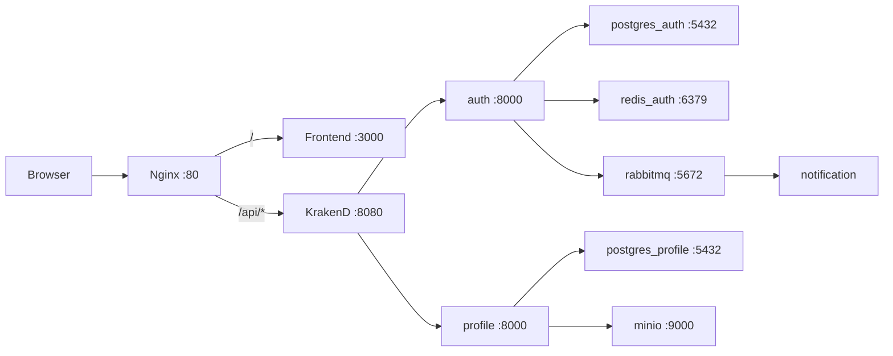

# LoreLounge

LoreLounge (Lore + Lounge) - платформа для чтения и каталогизации веб-новелл.

## Технологический стек

| Уровень | Технология |
|---------|------------|
| Frontend | Next.js 15, React 19, Tailwind CSS 4 |
| API Gateway | KrakenD 2.5 (Flexible Configuration) |
| Reverse Proxy | Nginx |
| Backend Services | FastAPI (auth, profile), FastStream (notification) |
| Storage | PostgreSQL 15, Redis 7, MinIO |
| Messaging | RabbitMQ |
| Infra | Docker, Docker Compose, Make |

## Архитектура

Единственная публичная точка входа - Nginx на порту 80.



## Сети Docker

- `lorelounge_net`: Nginx, KrakenD, frontend, auth, profile, notification, minio
- `auth_db_net`: auth, postgres_auth, redis_auth
- `profile_db_net`: profile, postgres_profile
- `broker_net` (internal): auth, profile, notification, rabbitmq

## Порты

| Сервис | Внешний порт | Назначение |
|--------|--------------|------------|
| nginx | 80 | Публичная точка входа |
| auth | 8000 | Отладочный доступ к auth |
| profile | 8001 | Отладочный доступ к profile |
| postgres_auth | 5432 | БД auth |
| postgres_profile | 5433 | БД profile |
| rabbitmq mgmt | 15672 | UI RabbitMQ |
| minio api | 9000 | S3 API |
| minio console | 9001 | MinIO Console |

## Структура проекта

```text
LoreLounge/
├── docs/
├── gateway/
│   ├── nginx.conf
│   └── krakend/
│       ├── krakend.tmpl.json
│       ├── endpoints/
│       ├── partials/
│       └── templates/
├── frontend/
├── infra/
│   ├── docker-compose.yml
│   ├── postgres/
│   └── scripts/
├── services/
│   ├── auth/
│   ├── profile/
│   ├── notification/
│   ├── comment/
│   ├── content/
│   └── library/
└── Makefile
```

## Быстрый старт

### Требования

- Docker 24+
- Docker Compose 2.20+
- Make

### Запуск

```bash
make up
```

### Остановка

```bash
make down
```

### Полезные команды

```bash
make logs
make ps
make certs
make migrate
```

## Маршрутизация через Nginx

- `/api/*` -> KrakenD
- `/api/auth/docs`, `/api/auth/redoc`, `/api/auth/openapi.json` -> auth напрямую
- `/*` -> frontend

## API через Gateway

### Auth

- `POST /api/auth/register`
- `POST /api/auth/login`
- `POST /api/auth/logout`
- `POST /api/auth/refresh`
- `POST /api/auth/password-reset-request`
- `POST /api/auth/password-reset-confirm`
- `GET /api/auth/me` (JWT)
- `POST /api/auth/role-request` (JWT)
- `GET /api/auth/role-requests/` (JWT)
- `POST /api/auth/role-requests/{request_id}/approve` (JWT)
- `POST /api/auth/role-requests/{request_id}/reject` (JWT)

### Profile

- `GET /api/profile/{name}` (public)
- `POST /api/profile/me` (JWT)
- `GET /api/profile/me` (JWT)
- `PATCH /api/profile/me` (JWT)
- `GET /api/profile/me/ignored` (JWT, pagination: `limit`, `offset`)
- `POST /api/profile/me/ignored/{target_user_id}` (JWT)
- `DELETE /api/profile/me/ignored/{target_user_id}` (JWT)

## KrakenD (Flexible Configuration)

```text
gateway/krakend/
├── krakend.tmpl.json
├── endpoints/
│   ├── auth-public.tmpl
│   ├── auth-protected.tmpl
│   ├── profile-public.tmpl
│   └── profile-protected.tmpl
├── partials/
│   ├── common-headers.json
│   └── jwt-validator.json
└── templates/
    └── backend.json
```

Проверка конфига KrakenD:

```bash
docker run -i --rm \
  -e FC_ENABLE=1 \
  -v "$PWD/gateway/krakend:/etc/krakend" \
  devopsfaith/krakend:2.5 \
  check -c /etc/krakend/krakend.tmpl.json
```

## Переменные окружения (ключевые)

### frontend

- `LORELOUNGE_API_BASE=http://krakend:8080/api`
- `PORT=3000`

### auth/profile

- DB параметры через compose env
- `RABBITMQ_URL`
- JWT/JWKS настройки auth
- MinIO параметры для profile

Подробные переменные смотри в:
- `infra/docker-compose.yml`
- `services/auth/.env.example`
- `services/profile/.env.example`

## Лицензия

MIT