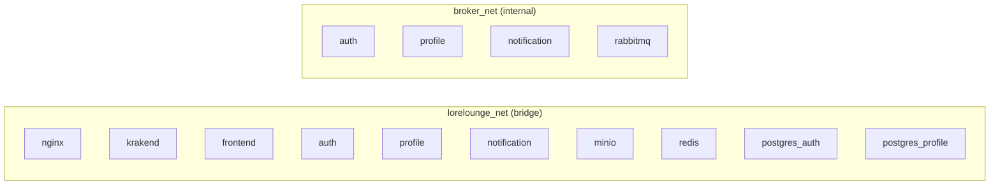
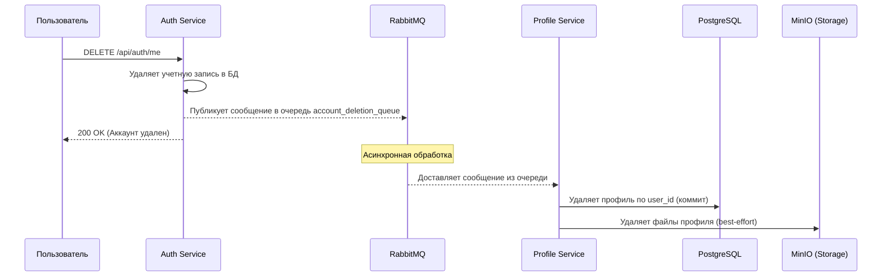
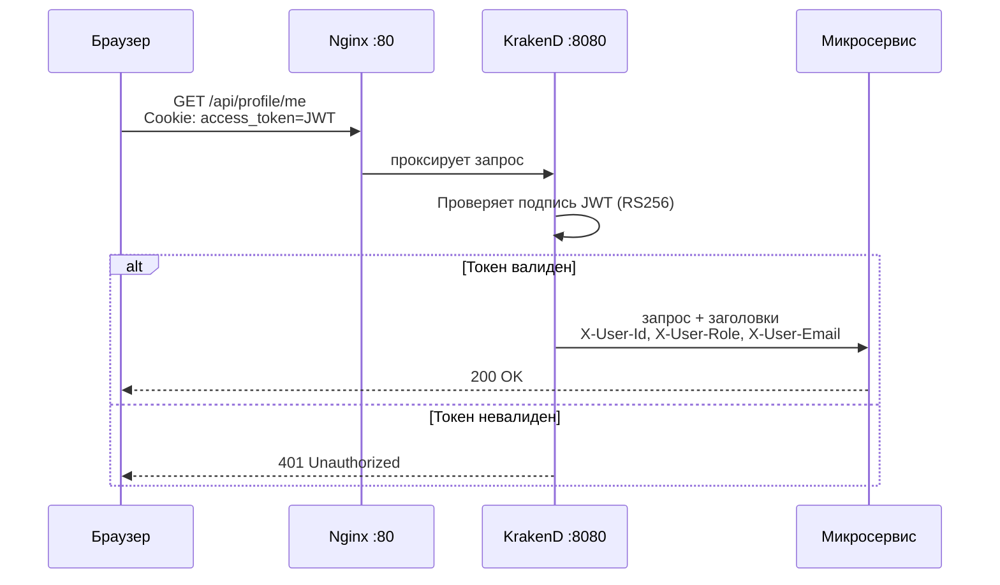

# LoreLounge

**LoreLounge** — платформа для чтения и каталогизации веб-новелл.

> Единственная публичная точка входа — **Nginx :80**. Все остальные порты открыты только для локальной отладки.

---

## Содержание

- [Стек технологий](#стек-технологий)
- [Архитектура](#архитектура)
- [Сетевая изоляция](#сетевая-изоляция)
- [Структура проекта](#структура-проекта)
- [Микросервисы](#микросервисы)
- [Быстрый старт](#быстрый-старт)
- [Маршрутизация](#маршрутизация)
- [Лицензия](#лицензия)

---

## Стек технологий

| Слой | Технологии |
|------|-----------|
| **Frontend** | Next.js 15, React 19, Tailwind CSS 4 |
| **Reverse Proxy** | Nginx |
| **API Gateway** | KrakenD 2.5 (Flexible Configuration) |
| **Микросервисы** | FastAPI (auth, profile), FastStream (notification) |
| **Базы данных** | PostgreSQL 15 (per-service), Redis 7 |
| **Хранилище файлов** | MinIO |
| **Брокер сообщений** | RabbitMQ 3 |
| **Инфраструктура** | Docker, Docker Compose, Make |

---

## Архитектура

```mermaid
---
config:
  flowchart:
    defaultRenderer: elk
  layout: dagre
---
flowchart LR
    %% --- Legend / Layout ---
    classDef gateway stroke:#818cf8,fill:#1e1b4b,color:#fff;
    classDef frontend stroke:#38bdf8,fill:#0c4a6e,color:#fff;
    classDef services stroke:#2dd4bf,fill:#134e4a,color:#fff;
    classDef storage stroke:#a3e635,fill:#365314,color:#fff;
    classDef broker stroke:#f87171,fill:#450a0a,color:#fff;
    classDef external stroke:#a78bfa,fill:#2e1065,color:#fff;

    Browser["Браузер<br/><small>Пользовательский интерфейс, который обращается к приложению</small>"]
    class Browser external

    subgraph gateway_layer["gateway_layer"]
        Nginx["Nginx<br/><small>HTTP маршрутизация и отдача статических файлов</small>"]
        KrakenD["KrakenD API Gateway<br/><small>Агрегация и передача запросов к микросервисам</small>"]
    end

    subgraph frontend_layer["frontend_layer"]
        Frontend["Next.js<br/><small>SSR/SPA клиентская часть приложения</small>"]
    end

    subgraph services_layer["services_layer"]
        Auth["Auth (FastAPI)<br/><small>Регистрация, вход, JWT токены</small>"]
        Profile["Profile (FastAPI)<br/><small>Хранение информации о пользователе</small>"]
        Notification["Notification (FastStream)<br/><small>Обработка и рассылка событий</small>"]
    end

    subgraph storage_layer["storage_layer"]
        PGAuth["Postgres Auth<br/><small>База данных авторизации</small>"]
        PGProfile["Postgres Profile<br/><small>База данных профилей</small>"]
        Redis["Redis<br/><small>Blacklist токенов (db=0)</small>"]
        MinIO["MinIO<br/><small>Хранение медиа и аватаров</small>"]
    end

    subgraph broker_layer["broker_layer"]
        RabbitMQ["RabbitMQ<br/><small>Обмен событиями между сервисами</small>"]
    end

    class Nginx,KrakenD gateway
    class Frontend frontend
    class Auth,Profile,Notification services
    class PGAuth,Redis,PGProfile,MinIO storage
    class RabbitMQ broker

    Browser -->|"HTTP :80"| Nginx
    Nginx -->|"/*"| Frontend
    Nginx -->|"/api/*"| KrakenD

    KrakenD -->|"JWT → headers"| Auth
    KrakenD -->|"JWT → headers"| Profile

    Auth -->|"SELECT / INSERT"| PGAuth
    Auth -->|"revoked tokens"| Redis
    Auth -->>|"publish: password_reset_queue"| RabbitMQ
    Auth -->>|"publish: account_deletion_queue"| RabbitMQ

    Profile -->|"SELECT / INSERT"| PGProfile
    Profile -->|"avatars / media"| MinIO

    RabbitMQ -->|"subscribe: account_deletion_queue"| Profile
    RabbitMQ -->|"subscribe: password_reset_queue"| Notification
```


---

## Сетевая изоляция

Каждый сервис видит только те соседей, которые ему нужны.



| Сеть | Участники | Примечание |
|------|-----------|-----------|
| `lorelounge_net` | nginx, krakend, frontend, auth, profile, notification, minio, redis, postgres_auth, postgres_profile | Основная сервисная сеть |
| `broker_net` | auth, profile, notification, rabbitmq | `internal: true` — без выхода наружу |

### Открытые порты

| Сервис | Внешний порт | Назначение |
|--------|:------------:|-----------|
| nginx | **80** | Единственная публичная точка входа |
| auth | 8000 | Прямой доступ для отладки |
| profile | 8001 | Прямой доступ для отладки |
| postgres_auth | 5432 | DataGrip / миграции |
| postgres_profile | 5433 | DataGrip |
| rabbitmq mgmt | 15672 | RabbitMQ Web UI |
| minio api | 127.0.0.1:9000 | S3 API (loopback) |
| minio console | 127.0.0.1:9001 | MinIO Console (loopback) |

---

## Основные потоки данных (Event-Driven)

### Удаление аккаунта (Account Deletion)

Процесс удаления данных пользователя реализован асинхронно через брокер сообщений для обеспечения консистентности между микросервисами.



**Поток обработки события:**

1.  **Auth Service**: Удаляет свою запись → публикует сообщение в очередь `account_deletion_queue`.
2.  **RabbitMQ**: Обеспечивает доставку сообщения из очереди.
3.  **Profile Service** (подписчик очереди):
    - Получает сообщение с `user_id`
    - Удаляет профиль из PostgreSQL (коммитит транзакцию)
    - Удаляет файлы из MinIO (best-effort, не блокирует при ошибках)

---

## Структура проекта

```text
LoreLounge/
├── docs/                        # Общая документация
├── gateway/                     # API Gateway (KrakenD) и Reverse Proxy (Nginx)
│   ├── nginx.conf               # Конфигурация Nginx (reverse proxy :80 → :3000, :8080)
│   ├── krakend/                 # KrakenD API Gateway
│   │   ├── krakend.tmpl.json    # Основной конфиг с шаблонизацией
│   │   └── partials/            # Переиспользуемые шаблоны для каждого сервиса
│   │       ├── auth-public.tmpl      # POST register, login, logout, refresh
│   │       ├── auth-protected.tmpl  # GET /me, DELETE /me, role-requests (JWT required)
│   │       ├── profile-public.tmpl   # GET user/{name} (public profile lookup)
│   │       ├── profile-protected.tmpl # GET/PUT/PATCH /me, /me/upload, /me/ignored (JWT required)
│   │       ├── headers-standard.tmpl # Стандартные заголовки (Content-Type, Authorization)
│   │       ├── headers-post.tmpl     # POST/PUT заголовки + JSON body validation
│   │       └── jwt-validator.tmpl    # Конфиг JWT валидации (RS256)
│   └── README.md                # Документация KrakenD и маршрутизации
├── frontend/                    # Next.js приложение
├── infra/                       # Docker Compose, скрипты, конфиги БД
├── services/                    # Микросервисы
│   ├── auth/                    # [README](services/auth/README.md) — Auth & Roles (FastAPI)
│   ├── profile/                 # [README](services/profile/README.md) — User Profiles (FastAPI)
│   ├── notification/            # [README](services/notification/README.md) — Emails (FastStream)
│   ├── content/                 # [в разработке] Новеллы и главы
│   └── comment/                 # [в разработке] Комментарии
└── Makefile                     # Команды управления проектом
```

### KrakenD структура

**Flexible Configuration** с Go-шаблонизацией:
- `krakend.tmpl.json` — точка входа, подключает партиалы через `{{ template "file.tmpl" . }}`
- `partials/auth-public.tmpl`, `partials/auth-protected.tmpl` — эндпоинты авторизации
- `partials/profile-public.tmpl`, `partials/profile-protected.tmpl` — эндпоинты профиля
- `partials/*protected.tmpl` переиспользуют `headers-*.tmpl` и `jwt-validator.tmpl` через `{{ template }}`

Добавление нового микросервиса: создать `partials/{service}-public.tmpl` и `partials/{service}-protected.tmpl` + добавить `{{ template "{service}-public.tmpl" . }}` в `krakend.tmpl.json`.

---

## Микросервисы

Подробную информацию о функционале, API и настройках каждого сервиса можно найти в их внутренних документах:

1.  [**Auth Service**](services/auth/README.md) — Регистрация, вход, JWT (RS256), роли, сброс пароля.
2.  [**Profile Service**](services/profile/README.md) — Профили, загрузка аватаров (MinIO), черные списки.
3.  [**Notification Service**](services/notification/README.md) — Отправка email через RabbitMQ.

---

## Быстрый старт

### Требования

- Docker 24+
- Docker Compose 2.20+
- Make

### Шаги

```bash
# 1. Скопировать переменные окружения
cp .env.example .env
cp services/auth/.env.example services/auth/.env
cp services/profile/.env.example services/profile/.env

# 2. Сгенерировать RSA-ключи для JWT
make certs

# 3. Запустить все сервисы
make up
```

Миграции БД уже применены через `init.sql` при первом запуске контейнеров.

После запуска приложение доступно на `http://localhost`.

### Основные команды Make

| Команда | Описание |
|---------|---------|
| `make up` | Запустить все сервисы (сборка при необходимости) |
| `make down` | Остановить все сервисы |
| `make build` | Пересобрать образы без кэша |
| `make logs` | Стримить логи всех сервисов |
| `make ps` | Статус контейнеров |
| `make clean` | Остановить и удалить все volumes |
| `make certs` | Сгенерировать RSA-ключи для JWT |

---

## Маршрутизация

Nginx направляет запросы на KrakenD (внутренний API Gateway), который проксирует их в соответствующие микросервисы. Публичные эндпоинты (login, logout, register, refresh) получают Cookie-заголовки от KrakenD для корректной работы аутентификации.

Для просмотра актуальных маршрутов — см. `gateway/krakend/partials/`.



---

## Лицензия

MIT
