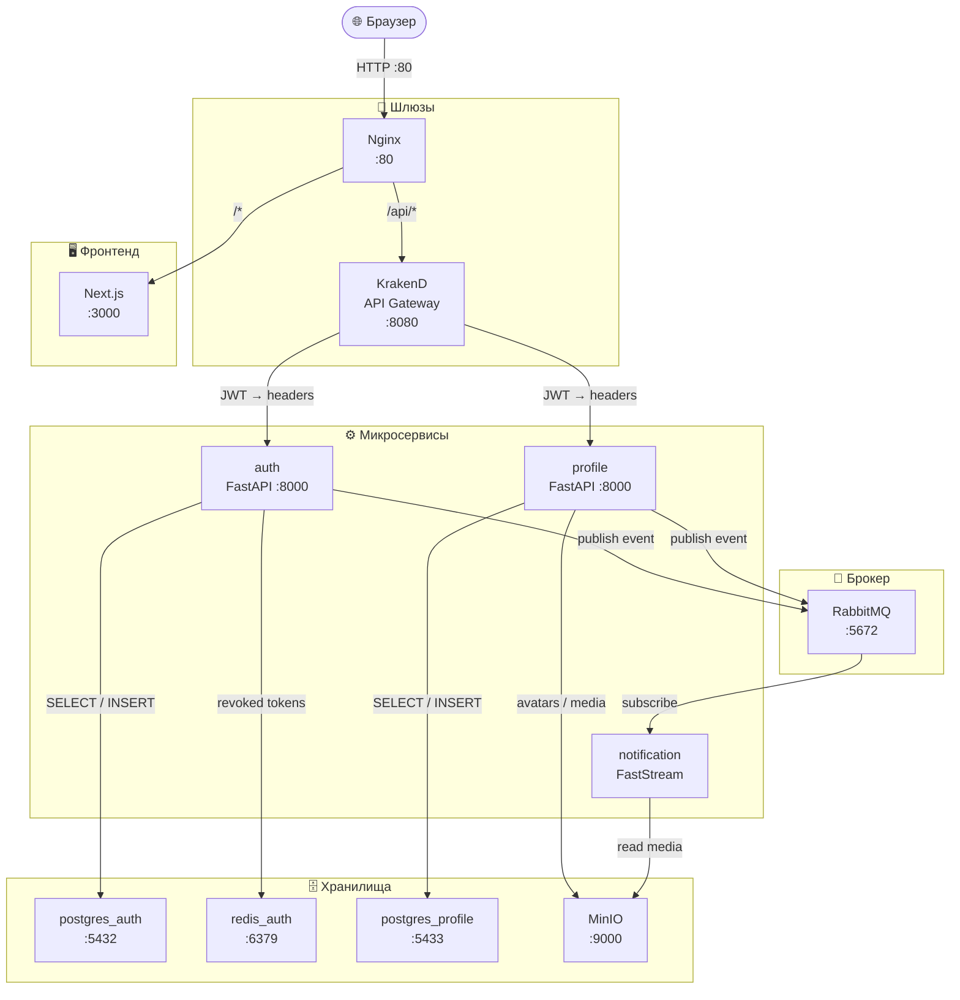
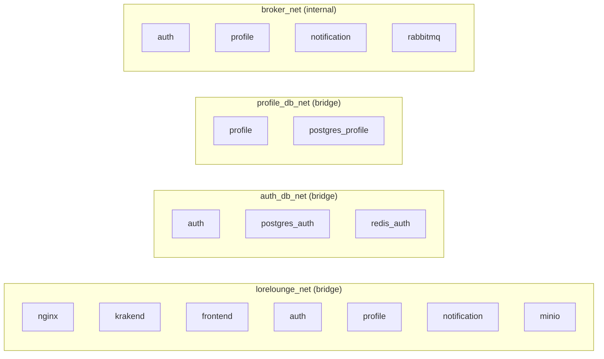
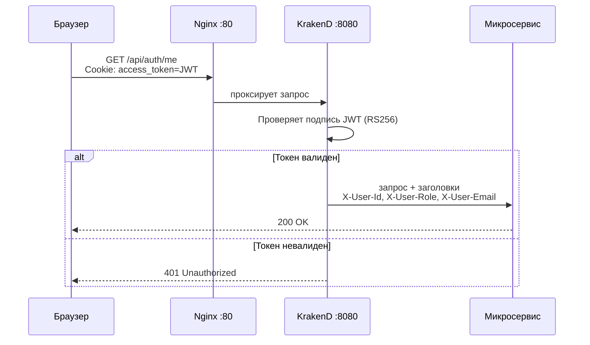

# LoreLounge

**LoreLounge** — платформа для чтения и каталогизации веб-новелл.

> Единственная публичная точка входа — **Nginx :80**. Все остальные порты открыты только для локальной отладки.

---

## Содержание

- [Стек технологий](#стек-технологий)
- [Архитектура](#архитектура)
- [Сетевая изоляция](#сетевая-изоляция)
- [Структура проекта](#структура-проекта)
- [Быстрый старт](#быстрый-старт)
- [Маршрутизация](#маршрутизация)
- [API](#api)
- [KrakenD](#krakend-flexible-configuration)
- [Переменные окружения](#переменные-окружения)
- [Лицензия](#лицензия)

---

## Стек технологий

| Слой | Технологии |
|------|-----------|
| **Frontend** | Next.js 15, React 19, Tailwind CSS 4 |
| **Reverse Proxy** | Nginx |
| **API Gateway** | KrakenD 2.5 (Flexible Configuration) |
| **Микросервисы** | FastAPI (auth, profile), FastStream (notification) |
| **Базы данных** | PostgreSQL 15 (per-service), Redis 7 |
| **Хранилище файлов** | MinIO |
| **Брокер сообщений** | RabbitMQ 3 |
| **Инфраструктура** | Docker, Docker Compose, Make |

---

## Архитектура



---

## Сетевая изоляция

Каждый сервис видит только те соседей, которые ему нужны.



| Сеть | Участники | Примечание |
|------|-----------|-----------|
| `lorelounge_net` | nginx, krakend, frontend, auth, profile, notification, minio | Основная сервисная сеть |
| `auth_db_net` | auth, postgres_auth, redis_auth | Изолирована: только auth видит свою БД |
| `profile_db_net` | profile, postgres_profile | Изолирована: только profile видит свою БД |
| `broker_net` | auth, profile, notification, rabbitmq | `internal: true` — без выхода наружу |

### Открытые порты

| Сервис | Внешний порт | Назначение |
|--------|:------------:|-----------|
| nginx | **80** | Единственная публичная точка входа |
| auth | 8000 | Прямой доступ для отладки |
| profile | 8001 | Прямой доступ для отладки |
| postgres_auth | 5432 | DataGrip / миграции |
| postgres_profile | 5433 | DataGrip |
| rabbitmq mgmt | 15672 | RabbitMQ Web UI |
| minio api | 127.0.0.1:9000 | S3 API (loopback) |
| minio console | 127.0.0.1:9001 | MinIO Console (loopback) |

---

## Структура проекта

```text
LoreLounge/
├── docs/                        # Документация (architecture.md и др.)
├── gateway/
│   ├── nginx.conf               # Reverse proxy — публичная точка входа
│   └── krakend/
│       ├── krakend.tmpl.json    # Главный конфиг (Flexible Configuration)
│       ├── endpoints/           # Шаблоны эндпоинтов
│       ├── partials/            # Переиспользуемые блоки (JWT, headers)
│       └── templates/           # Шаблоны бэкендов
├── frontend/                    # Next.js приложение
├── infra/
│   ├── docker-compose.yml       # Вся инфраструктура
│   ├── postgres/                # init.sql скрипты для БД
│   └── scripts/                 # generate-certs.sh, migrate.sh
├── services/
│   ├── auth/                    # Аутентификация и авторизация (FastAPI)
│   ├── profile/                 # Профили пользователей (FastAPI)
│   ├── notification/            # Отправка уведомлений (FastStream)
│   ├── content/                 # [в разработке] Новеллы и главы
│   └── comment/                 # [в разработке] Комментарии
└── Makefile                     # Удобные команды для разработки
```

---

## Быстрый старт

### Требования

- Docker 24+
- Docker Compose 2.20+
- Make

### Шаги

```bash
# 1. Скопировать переменные окружения
cp .env.example .env
cp services/auth/.env.example services/auth/.env
cp services/profile/.env.example services/profile/.env

# 2. Сгенерировать RSA-ключи для JWT
make certs

# 3. Применить миграции БД
make migrate

# 4. Запустить все сервисы
make up
```

После запуска приложение доступно на `http://localhost`.

### Основные команды Make

| Команда | Описание |
|---------|---------|
| `make up` | Запустить все сервисы (сборка при необходимости) |
| `make down` | Остановить все сервисы |
| `make build` | Пересобрать образы без кэша |
| `make logs` | Стримить логи всех сервисов |
| `make ps` | Статус контейнеров |
| `make clean` | Остановить и удалить все volumes ⚠️ |
| `make certs` | Сгенерировать RSA-ключи для JWT |
| `make migrate` | Применить Alembic-миграции (auth) |
| `make migrate-gen MSG="..."` | Создать новую миграцию |

---

## Маршрутизация

### Nginx → сервисы

| Путь | Назначение |
|------|-----------|
| `/api/auth/docs`, `/api/auth/redoc`, `/api/auth/openapi.json` | Swagger auth (напрямую) |
| `/api/*` | KrakenD API Gateway |
| `/*` | Next.js Frontend |

### Поток авторизованного запроса



---

## API

### Auth (`/api/auth`)

| Метод | Путь | Доступ | Описание |
|-------|------|:------:|---------|
| POST | `/register` | public | Регистрация |
| POST | `/login` | public | Вход (выдаёт JWT cookies) |
| POST | `/logout` | public | Выход (отзывает refresh) |
| POST | `/refresh` | public | Обновление access-токена |
| POST | `/password-reset-request` | public | Запрос сброса пароля |
| POST | `/password-reset-confirm` | public | Подтверждение сброса пароля |
| GET | `/me` | 🔒 JWT | Данные текущего пользователя |
| POST | `/role-request` | 🔒 JWT | Заявка на изменение роли |
| GET | `/role-requests/` | 🔒 JWT | Список заявок на роль |
| POST | `/role-requests/{id}/approve` | 🔒 JWT | Одобрить заявку |
| POST | `/role-requests/{id}/reject` | 🔒 JWT | Отклонить заявку |

### Profile (`/api/profile`)

| Метод | Путь | Доступ | Описание |
|-------|------|:------:|---------|
| GET | `/{name}` | public | Публичный профиль пользователя |
| GET | `/me` | 🔒 JWT | Мой профиль |
| POST | `/me` | 🔒 JWT | Создать профиль |
| PATCH | `/me` | 🔒 JWT | Обновить профиль |
| GET | `/me/ignored` | 🔒 JWT | Список игнорируемых (`limit`, `offset`) |
| POST | `/me/ignored/{target_user_id}` | 🔒 JWT | Добавить в игнор |
| DELETE | `/me/ignored/{target_user_id}` | 🔒 JWT | Убрать из игнора |

---

## KrakenD (Flexible Configuration)

```text
gateway/krakend/
├── krakend.tmpl.json            # Точка входа (FC_ENABLE=1)
├── endpoints/
│   ├── auth-public.tmpl         # Публичные эндпоинты auth
│   ├── auth-protected.tmpl      # Защищённые эндпоинты auth
│   ├── profile-public.tmpl      # Публичные эндпоинты profile
│   └── profile-protected.tmpl   # Защищённые эндпоинты profile
├── partials/
│   ├── common-headers.json      # Общие заголовки
│   └── jwt-validator.json       # Настройки JWT (RS256, JWKS)
└── templates/
    └── backend.json             # Шаблон бэкенда
```

Проверка конфигурации:

```bash
docker run -i --rm \
  -e FC_ENABLE=1 \
  -v "$PWD/gateway/krakend:/etc/krakend" \
  devopsfaith/krakend:2.5 \
  check -c /etc/krakend/krakend.tmpl.json
```

---

## Переменные окружения

### Frontend

| Переменная | Значение по умолчанию | Описание |
|------------|----------------------|---------|
| `LORELOUNGE_API_BASE` | `http://krakend:8080/api` | Внутренний адрес API Gateway |
| `PORT` | `3000` | Порт Next.js сервера |

### Auth

| Переменная | Описание |
|------------|---------|
| `CONFIG__DB__URL` | PostgreSQL connection string |
| `CONFIG__AUTH__ACCESS_EXPIRE_MIN` | TTL access-токена (минуты) |
| `CONFIG__AUTH__REFRESH_EXPIRE_DAYS` | TTL refresh-токена (дни) |
| `CONFIG__REDIS__URL` | Redis (хранение отозванных токенов) |
| `CONFIG__FRONTEND_URL` | URL фронтенда для ссылок сброса пароля |
| `RABBITMQ_URL` | AMQP URL брокера |

### Profile

| Переменная | Описание |
|------------|---------|
| `PROFILE_CONFIG__DB__*` | Параметры подключения к PostgreSQL |
| `PROFILE_CONFIG__MINIO__*` | Параметры MinIO (endpoint, keys, bucket) |
| `RABBITMQ_URL` | AMQP URL брокера |

Полные примеры переменных:
- [`services/auth/.env.example`](services/auth/.env.example)
- [`services/profile/.env.example`](services/profile/.env.example)
- [`infra/docker-compose.yml`](infra/docker-compose.yml)

---

## Лицензия

MIT