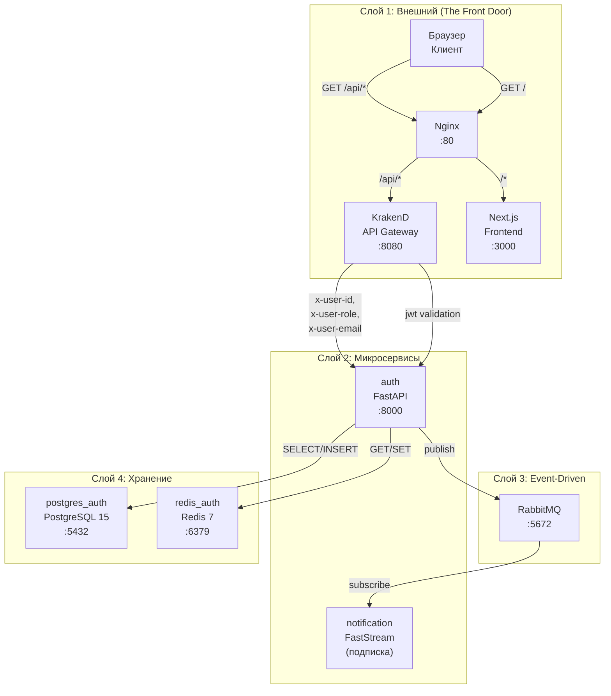
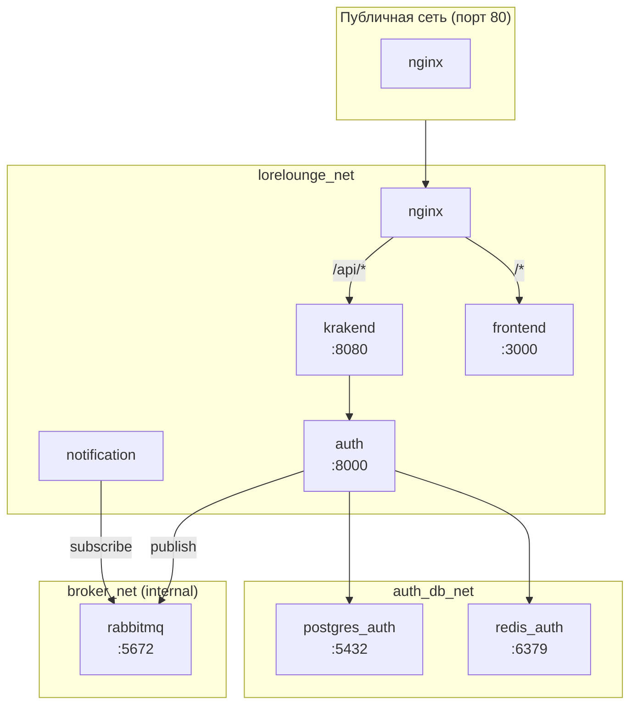
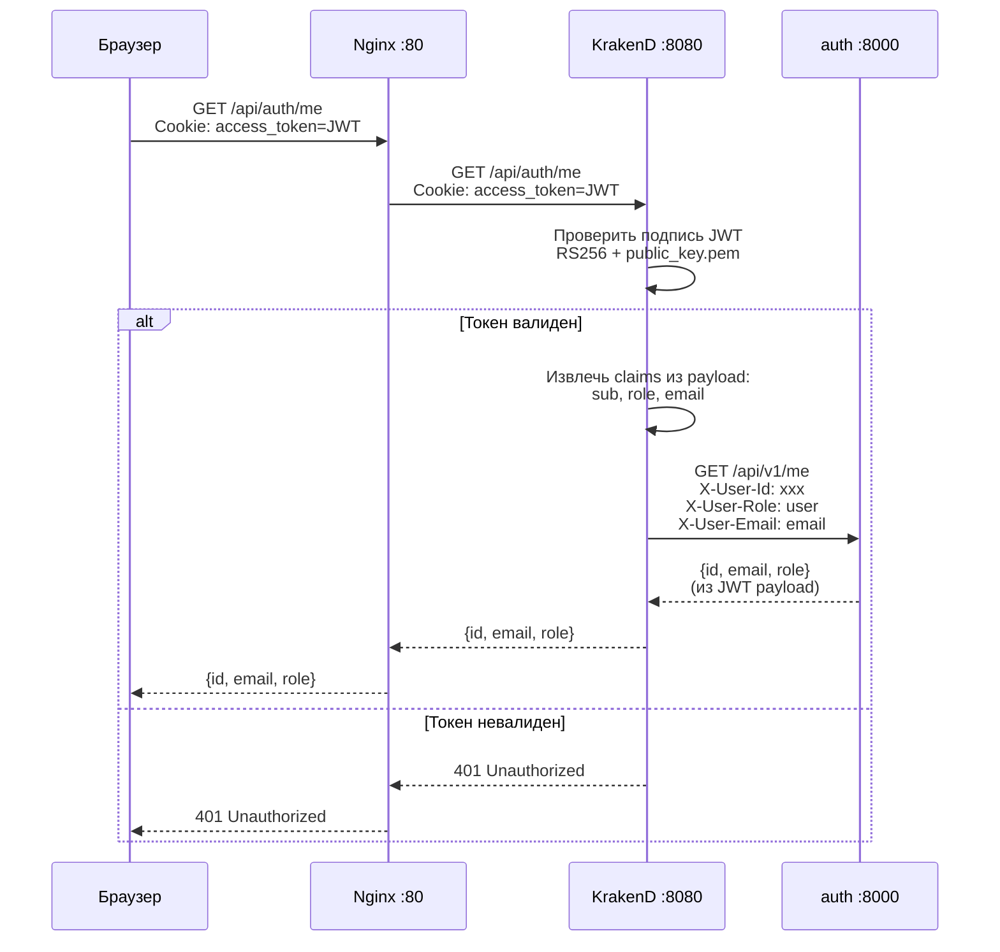
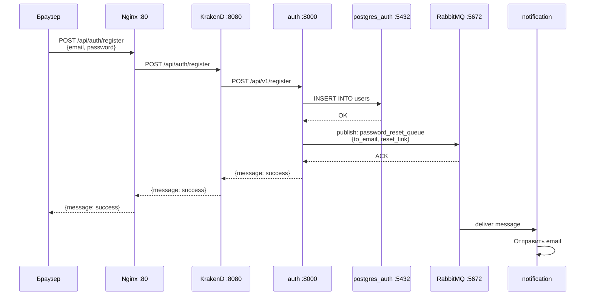
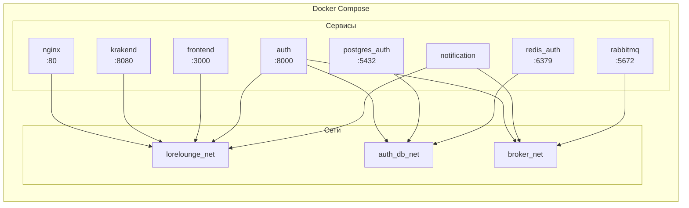

# LoreLounge — Архитектура (Mermaid диаграммы)

## Структура проекта

```
loreLounge/
├── docs/                     # Документация (этот файл)
├── gateway/                  # Шлюзы
│   ├── nginx.conf            # Nginx — публичная точка входа (:80)
│   └── krakend/               # KrakenD API Gateway (:8080)
│       ├── krakend.tmpl.json  # Главный конфиг
│       ├── endpoints/         # Эндпоинты
│       ├── partials/          # Переиспользуемые блоки
│       └── templates/         # Шаблоны
├── frontend/                 # Next.js (:3000)
├── services/
│   ├── auth/                  # Auth Service (FastAPI :8000)
│   └── notification/          # Notification Service (FastStream)
├── infra/                    # Docker инфраструктура
│   ├── docker-compose.yml
│   └── postgres/auth/init.sql
└── Makefile
```

## 4 слоя системы



## Ports Summary

| Сервис | Port | Назначение |
|--------|------|-------------|
| nginx | 80 | Публичный вход (единственный) |
| krakend | 8080 | API Gateway |
| frontend | 3000 | Next.js |
| auth | 8000 | Auth Service |
| rabbitmq | 5672 | AMQP |
| rabbitmq (mgmt) | 15672 | RabbitMQ UI |
| postgres_auth | 5432 | PostgreSQL |
| redis_auth | 6379 | Redis |

## Сетевая изоляция



### Сетевая изоляция (сервисы)

| Network | Сервисы | Доступ |
|---------|---------|--------|
| `lorelounge_net` | nginx, krakend, frontend, auth, notification | Внутри Docker |
| `auth_db_net` | postgres_auth, redis_auth | Только auth |
| `broker_net` (internal) | rabbitmq | Только сервисы |

## Поток авторизованного запроса



**Примечание:** `/api/v1/me` НЕ обращается к БД — данные берутся напрямую из JWT payload.

## Поток регистрации + async email



**Примечание:** Nginx также проксирует `/api/v1/docs` → `auth:8000` напрямую для Swagger UI.

## Диаграмма Docker сетей



## Gateway поток (Nginx)

```
/api/*       → KrakenD (:8080)
/api/v1/docs → auth:8000 ( напрямую для Swagger )
/*          → Frontend (:3000)
```

## KrakenD Endpoints

### Публичные (без JWT)
- `/api/auth/register` → auth
- `/api/auth/login` → auth
- `/api/auth/logout` → auth
- `/api/auth/password-reset-request` → auth
- `/api/auth/password-reset-confirm` → auth

### Защищённые (требуют JWT)
- `/api/auth/me` → auth
- `/api/auth/role-request` → auth
- `/api/v1/role-requests/` → auth
- `/api/v1/role-requests/{id}/approve` → auth
- `/api/v1/role-requests/{id}/reject` → auth