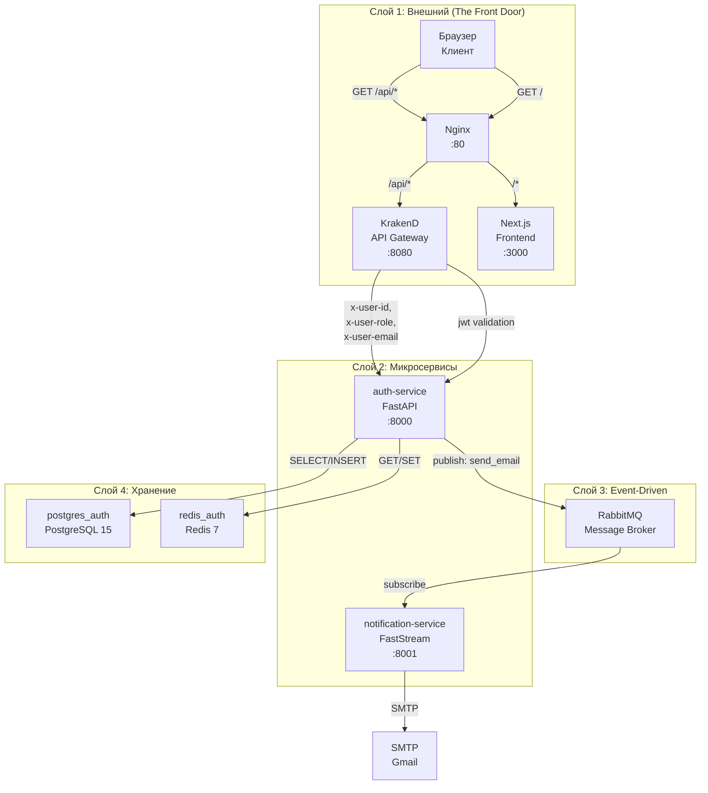
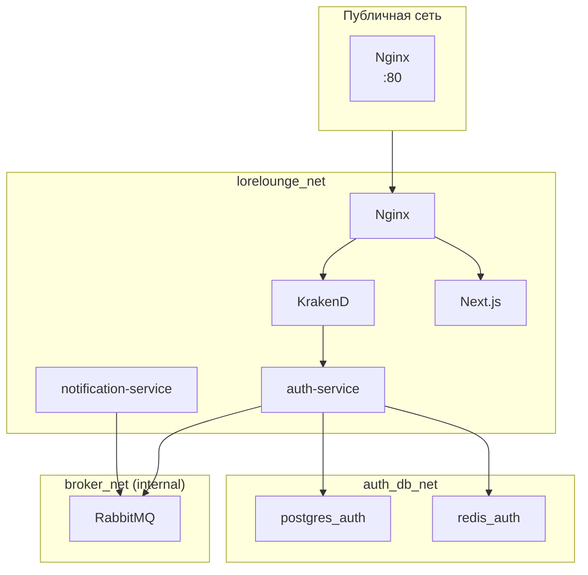
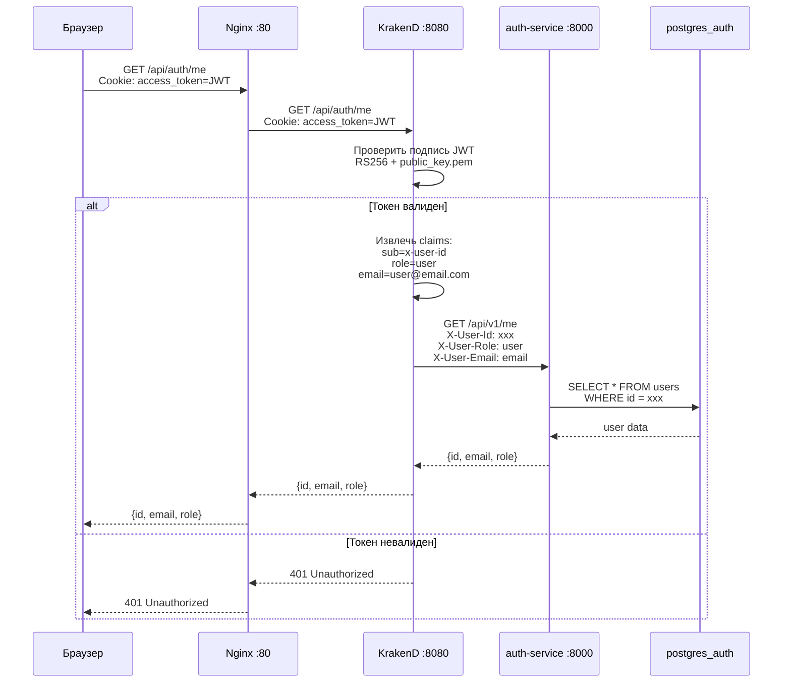
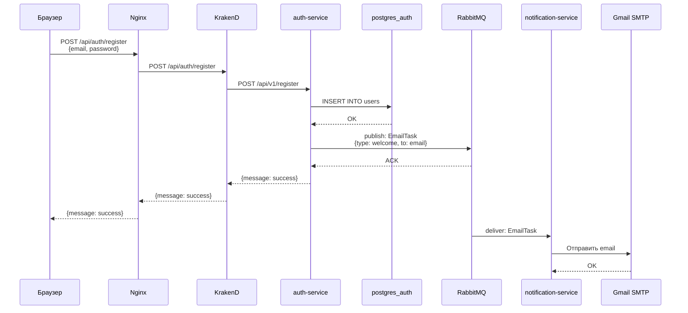
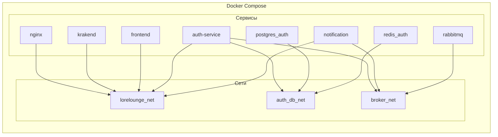

# LoreLounge — Архитектура (Mermaid диаграммы)

## 4 слоя системы

```mermaid
flowchart TB
    subgraph Ext["Слой 1: Внешний (The Front Door)"]
        Browser["Браузер<br/>Клиент"]
        Nginx["Nginx<br/>:80"]
        KrakenD["KrakenD<br/>API Gateway<br/>:8080"]
        NextJS["Next.js<br/>Frontend<br/>:3000"]
    end

    subgraph Micro["Слой 2: Микросервисы"]
        Auth["auth-service<br/>FastAPI<br/>:8000"]
        Notif["notification-service<br/>FastStream<br/>:8001"]
    end

    subgraph Event["Слой 3: Event-Driven"]
        RMQ["RabbitMQ<br/>Message Broker"]
    end

    subgraph Storage["Слой 4: Хранение"]
        PG["postgres_auth<br/>PostgreSQL 15"]
        Redis["redis_auth<br/>Redis 7"]
    end

    Browser -->|"GET /"| Nginx
    Browser -->|"GET /api/*"| Nginx
    Nginx -->|"/*"| NextJS
    Nginx -->|"/api/*"| KrakenD
    KrakenD -->|jwt validation| Auth
    KrakenD -->|"x-user-id,<br/>x-user-role,<br/>x-user-email"| Auth

    Auth -->|"publish: send_email"| RMQ
    RMQ -->|"subscribe"| Notif

    Auth -->|"SELECT/INSERT"| PG
    Auth -->|"GET/SET"| Redis

    Notif -->|"SMTP"| External["SMTP<br/>Gmail"]
```

## Сетевая изоляция

```mermaid
flowchart TB
    subgraph Public["Публичная сеть"]
        NginxP["Nginx<br/>:80"]
    end

    subgraph Lorelounge["lorelounge_net"]
        Nginx["Nginx"]
        KrakenD["KrakenD"]
        NextJS["Next.js"]
        Auth["auth-service"]
        Notif["notification-service"]
    end

    subgraph AuthDB["auth_db_net"]
        PGA["postgres_auth"]
        RDSA["redis_auth"]
    end

    subgraph Broker["broker_net (internal)"]
        RMQ["RabbitMQ"]
    end

    Public --> Nginx
    Nginx --> KrakenD
    Nginx --> NextJS
    KrakenD --> Auth
    Auth --> RMQ
    Notif --> RMQ
    Auth --> PGA
    Auth --> RDSA
```

## Поток авторизованного запроса

```mermaid
sequenceDiagram
    participant B as Браузер
    participant N as Nginx :80
    participant K as KrakenD :8080
    participant A as auth-service :8000
    participant PG as postgres_auth

    B->>N: GET /api/auth/me<br/>Cookie: access_token=JWT

    N->>K: GET /api/auth/me<br/>Cookie: access_token=JWT

    K->>K: Проверить подпись JWT<br/>RS256 + public_key.pem

    alt Токен валиден
        K->>K: Извлечь claims:<br/>sub=x-user-id<br/>role=user<br/>email=user@email.com
        K->>A: GET /api/v1/me<br/>X-User-Id: xxx<br/>X-User-Role: user<br/>X-User-Email: email
        A->>PG: SELECT * FROM users<br/>WHERE id = xxx
        PG-->>A: user data
        A-->>K: {id, email, role}
        K-->>N: {id, email, role}
        N-->>B: {id, email, role}
    else Токен невалиден
        K-->>N: 401 Unauthorized
        N-->>B: 401 Unauthorized
    end
```

## Поток регистрации +异步 email

```mermaid
sequenceDiagram
    participant B as Браузер
    participant N as Nginx
    participant K as KrakenD
    participant A as auth-service
    participant PG as postgres_auth
    participant RMQ as RabbitMQ
    participant Notif as notification-service
    participant SMTP as Gmail SMTP

    B->>N: POST /api/auth/register<br/>{email, password}
    N->>K: POST /api/auth/register
    K->>A: POST /api/v1/register
    A->>PG: INSERT INTO users
    PG-->>A: OK
    A->>RMQ: publish: EmailTask<br/>{type: welcome, to: email}
    RMQ-->>A: ACK
    A-->>K: {message: success}
    K-->>N: {message: success}
    N-->>B: {message: success}

    RMQ->>Notif: deliver: EmailTask
    Notif->>SMTP: Отправить email
    SMTP-->>Notif: OK
```

## Диаграмма Docker сетей

```mermaid
flowchart LR
    subgraph Docker["Docker Compose"]
        subgraph Networks["Сети"]
            Net1["lorelounge_net"]
            Net2["auth_db_net"]
            Net3["broker_net"]
        end

        subgraph Services["Сервисы"]
            Nginx["nginx"]
            KrakenD["krakend"]
            NextJS["frontend"]
            Auth["auth-service"]
            Notif["notification"]
            PG["postgres_auth"]
            Redis["redis_auth"]
            RMQ["rabbitmq"]
        end

        Nginx --> Net1
        KrakenD --> Net1
        NextJS --> Net1
        Auth --> Net1
        Notif --> Net1

        Auth --> Net2
        PG --> Net2
        Redis --> Net2

        Auth --> Net3
        Notif --> Net3
        RMQ --> Net3
    end
```